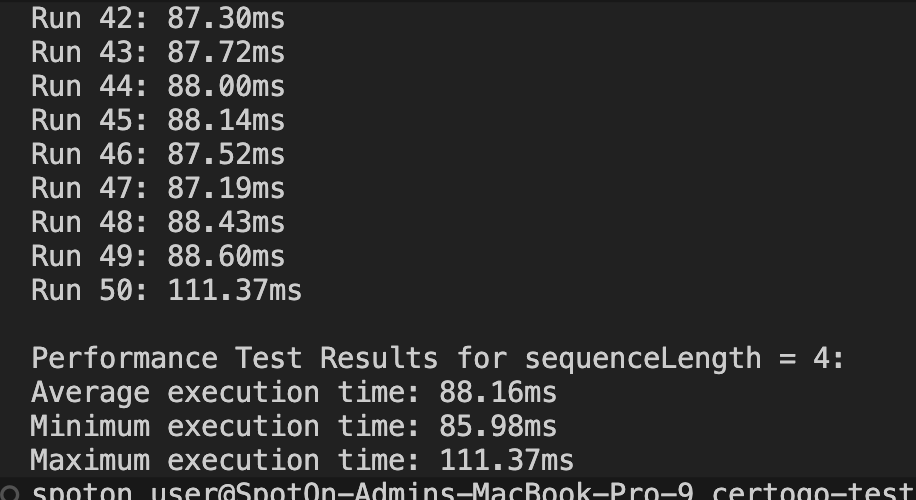

# Certogo Test

## Description

The project for Certogo test to find consecutive numbers that are the result of multiplying prime numbers together, where the number of prime factors for each number equals the length of the consecutive sequence. The project includes scripts for running the main program, testing, and performance testing.

## Installation


### Prerequisites
1. Clone this project by running the following command:
   ```
   git clone <repository_url>
   ```
2. Install Node.js by following the instructions on the official Node.js website: https://nodejs.org/.
3. Ensure npx is available (it comes bundled with Node.js).
4. (Optional) If you want to run the project using a Makefile, install `make` by searching for instructions on the internet.

## Usage

### Running the Function
1. To run the function with a specific sequence count, use the command `npm run start <sequenceCount>`. For example, to run the function with a sequence count of 3, use:
   ```
   npm run start 3
   ```
   If no sequence count is provided, it will default to 4.

2. If you have installed `make`, you can run the function with a specific sequence count using the command `make run INPUT=<sequenceCount>`. For example, to run the function with a sequence count of 3, use:
   ```
   make run INPUT=3
   ```

### Running the Tests
1. To run the tests, use the command `npm run test`. For example:
   ```
   npm run test
   ```

2. If you have installed `make`, you can run the tests using the command `make test`. For example:
   ```
   make test
   ```
### Running the Performance Test
1. To run the performance test, use the command `npm run perf <sequenceCount> <iterations>`. If no parameters are provided, it will default to a sequence count of 4 and 100 iterations. For example:
   ```
   npm run perf
   ```
   or with specific parameters:
   ```
   npm run perf 3 1000
   ```

2. If you have installed `make`, you can run the performance test with a specific sequence count and iterations using the command `make perf INPUT=<sequenceCount> ITERATIONS=<iterations>`. For example:
   ```
   make perf INPUT=3 ITERATIONS=1000
   ```

### Performance Test Results

These results are based on running the performance test using the command `npm run perf 4 50` or `make perf INPUT=4 ITERATIONS=50` as described in the "Running the Performance Test" section above.


